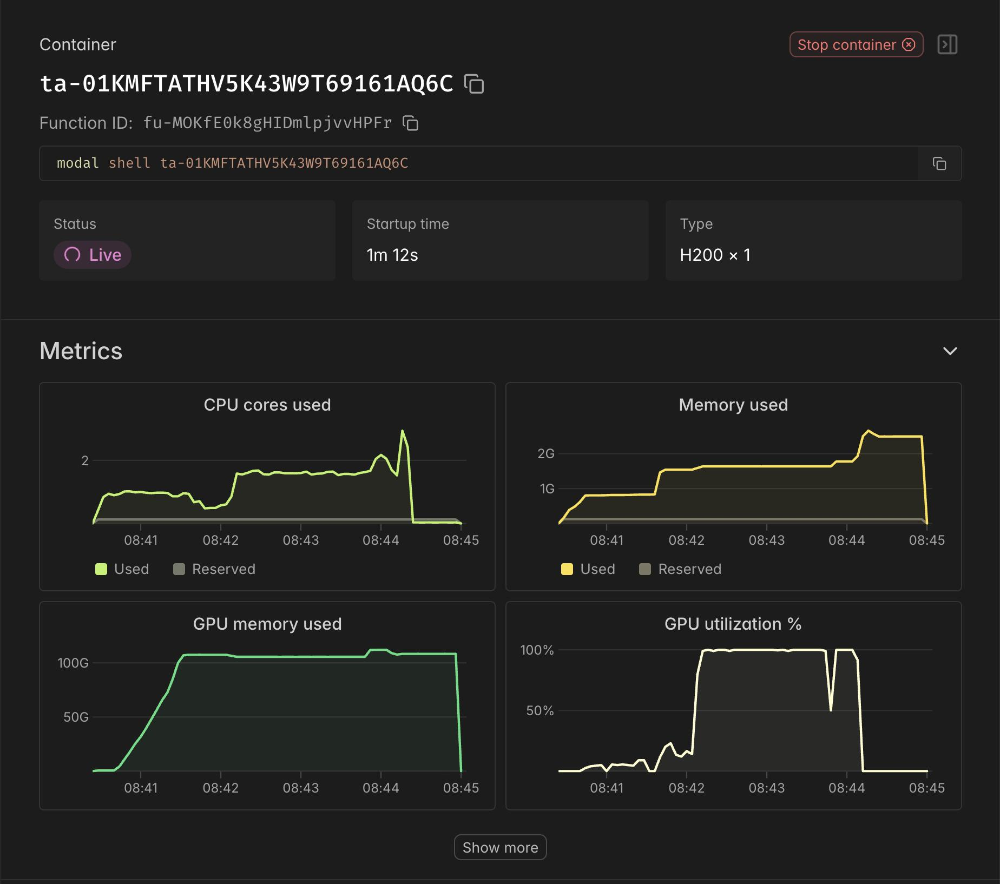
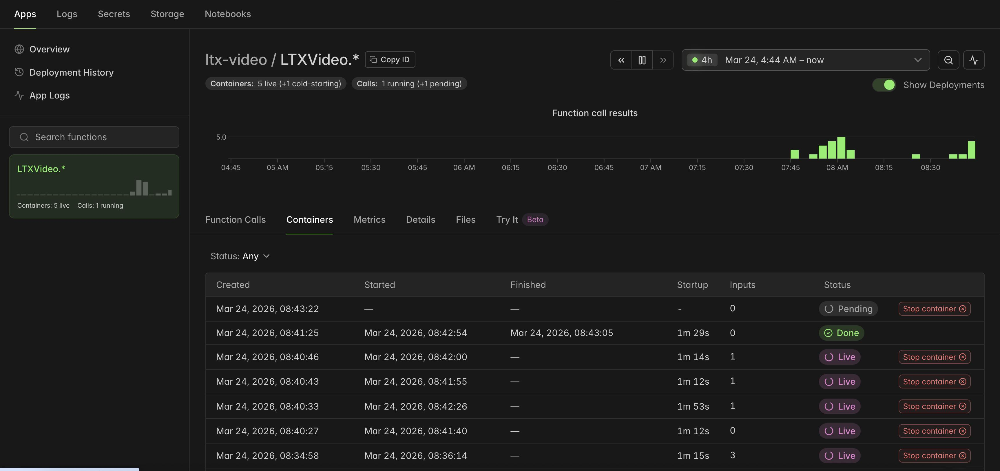

# LTX-2.3 on Modal

Run [Lightricks LTX-2.3](https://huggingface.co/Lightricks/LTX-2.3) (22B parameters) on [Modal](https://modal.com/) H200 GPUs. All 6 generation modes — text-to-video, image-to-video, HQ, audio-to-video, keyframe interpolation, and temporal retake.

LTX-2.3 is a joint video+audio model — every mode generates synchronized audio alongside the video.

## Setup

```bash
uv add modal
uv run modal setup                       # one-time auth
```

Create a `.env` file with your Hugging Face token (needed for the [Gemma 3](https://huggingface.co/google/gemma-3-12b-it-qat-q4_0-unquantized) text encoder, which requires accepting Google's license):

```
HF_TOKEN=hf_your_token_here
```

Deploy:

```bash
uv run modal deploy generate_video.py
```

Models download automatically on first request and are cached on a Modal volume. After container startup, containers stay warm for 15 minutes if idle. VRAM usage depends on the mode. Two-stage modes (standard, hq, a2vid, keyframe) keep two full transformers plus shared models in VRAM (~100+ GB). Single-stage modes (fast, retake) keep one transformer (~50–60 GB).

## Generate a video

```python
import modal

LTXVideo = modal.Cls.from_name("ltx-video", "LTXVideo")

prompt = """A sleek black sports car races out of a tunnel into blinding golden hour light, The camera view is from the inside of the car, looking out the windshield."""

ltx = LTXVideo(mode="standard")
result = ltx.generate.remote(prompt=prompt)

with open("car_race.mp4", "wb") as f:
    f.write(result["video_bytes"])
```

Videos are also saved to the `ltx-outputs` Modal volume with JSON metadata.

## Modes

| Mode | Resolution | Steps | Description |
|------|-----------|-------|-------------|
| **standard** | 1024x1536 | 30 | Best quality text/image-to-video (two-stage with 2x upscale) |
| **fast** | 1024x1536 | 8+4 | ~4x faster, distilled model (two-stage) |
| **hq** | 1088x1920 | 15 | 1080p with second-order sampler (two-stage) |
| **a2vid** | 1024x1536 | 30 | Audio-conditioned video generation (two-stage) |
| **keyframe** | 1024x1536 | 30 | Interpolation between keyframe images (two-stage) |
| **retake** | (from input) | 40 | Regenerate a time region of existing video (single-stage, no upscale) |

All resolutions and step counts are defaults — you can override them via parameters.

### Precision

Pass `precision="fp8"` to quantize the transformer weights (FP8 cast). Lower VRAM usage, slightly lower quality. Works with any mode.

```python
ltx = LTXVideo(mode="standard", precision="fp8")
```

## Constraints

- **Frame count** must satisfy `(frames - 1) % 8 == 0` — i.e. 9, 17, 25, …, 97, 121, 193, etc. Invalid counts are automatically rounded up. Duration = `num_frames / frame_rate` — the default 121 frames at 24 fps is ~5 seconds.
- **Resolution** must be divisible by 64 (height and width).
- **Retake input video** must already satisfy `8k+1` frame count and resolution divisible by 32. The output keeps the source video's resolution and frame rate.

## Examples

### Image-to-video

```python
ltx = LTXVideo(mode="standard")
result = ltx.generate.remote(
prompt="INT. SPACECRAFT COCKPIT – anime cel-shaded style. A teenage male pilot in an orange mission flight suit grips a joystick, cockpit HUD screens glowing green, red warning lights pulsing on the walls. The camera holds nearly static on the existing framing, with a very subtle slow push-in toward the pilot's face. His eyes shift slightly, jaw tightens, and his grip hand micro-adjusts on the joystick. The red emergency lights continue their slow rhythmic pulse. A low cockpit alarm hums faintly in the background.",
image_bytes=open("static/test_image.jpeg", "rb").read(),
seed=42,
)
with open("animated_image.mp4", "wb") as f:
    f.write(result["video_bytes"])
```

### Audio-to-video

```python
ltx = LTXVideo(mode="a2vid")
result = ltx.generate_from_audio.remote(
prompt="A guitarist shreds a solo on stage", audio_bytes=open("static/test_audio.wav", "rb").read())
with open("audio_video.mp4", "wb") as f:
    f.write(result["video_bytes"])
```

### Keyframe interpolation

```python
ltx = LTXVideo(mode="keyframe")
result = ltx.interpolate.remote(
prompt="An astronaut in a white spacesuit walks steadily forward across a rocky alien ridge at dawn. The camera is static, wide cinematic shot from behind. He steps off the jagged rock edge and strides forward into the vast orange desert, growing slightly smaller in frame. His arms swing naturally mid-walk. The dawn sky gradually brightens — the orange horizon glow expands upward into lavender. Two moons hang motionless in the indigo sky. Dust drifts faintly around his boots. Smooth, slow, cinematic movement. Photorealistic.",
keyframe_images=[
        (open("static/img1.jpeg", "rb").read(), 0, 1.0),
        (open("static/img2.jpeg", "rb").read(), 120, 1.0),
    ],
    num_frames=121,
)
with open("interpolated_video.mp4", "wb") as f:
    f.write(result["video_bytes"])
```

### Using optional parameters

```python
ltx = LTXVideo(mode="standard")
result = ltx.generate.remote(
    prompt="A calm forest stream at sunrise, light filtering through the canopy",
    negative_prompt="blurry, low quality, distorted",
    seed=123,
    num_frames=193,          # ~8 seconds at 24fps (must be 8k+1)
    height=1024,
    width=1536,
    enhance_prompt=True,     # let the model expand your prompt
)
with open("enhanced_video.mp4", "wb") as f:
    f.write(result["video_bytes"])
```

### Comparing Standard vs Fast vs HQ vs FP8

```python
prompt = "INT. SUNLIT APARTMENT – LATE AFTERNOON fluffy tabby cat sits curled on a windowsill, warm golden light washing across its fur, soft shadows pooling beneath it. The camera holds a gentle static medium shot, barely breathing with the faintest slow push-in toward the cat's face. The cat blinks slowly, shifts its weight, and turns its head slightly toward the glass. A curtain beside it sways once in a lazy draft, then stills. Outside, leaves flutter and birds chirp softly in the distance."

for mode, filename in [("standard", "cat_standard"), ("hq", "cat_hq"), ("fast", "cat_fast")]:
    ltx = LTXVideo(mode=mode)
    result = ltx.generate.remote(prompt=prompt)
    with open(f"{filename}.mp4", "wb") as f:
        f.write(result["video_bytes"])

# Same thing but with FP8 quantization
ltx = LTXVideo(mode="standard", precision="fp8")
result = ltx.generate.remote(prompt=prompt)
with open("cat_standard_fp8.mp4", "wb") as f:
    f.write(result["video_bytes"])
```

### Longer video (20 seconds)

Set `num_frames=481` for a 20-second video at 24fps. Write a prompt with enough action to fill the duration — think like a cinematographer.

```python
prompt = """EXT. FISHING VILLAGE — DAWN. A weathered old fisherman in a faded blue jacket stands at the end of a wooden dock, coiling rope in his hands. The camera holds a wide establishing shot, mist rolling off the still harbor water. He pauses, squints toward the horizon where a pale orange sun is just breaking through the clouds. Seagulls cry overhead. He mutters to himself, "Gonna be a good one today," and tosses the rope into a small boat bobbing beside the dock. The camera slowly pushes in as he steps down into the boat, the wood creaking under his weight. He pulls the outboard motor cord twice — it sputters, catches, and rumbles to life. The boat drifts forward through the glassy water, leaving a widening wake. The camera tracks alongside as the dock and village shrink behind him, fog swallowing the shoreline. The only sound is the low hum of the motor and the gentle lap of water against the hull."""

ltx = LTXVideo(mode="standard")
result = ltx.generate.remote(prompt=prompt, num_frames=481, seed=77)

with open("fisherman.mp4", "wb") as f:
    f.write(result["video_bytes"])
```

## Parameters

### `generate()` (standard, fast, hq)

| Parameter | Default | Notes |
|-----------|---------|-------|
| `prompt` | required | Text description of the video |
| `negative_prompt` | `""` | What to avoid (ignored in fast mode) |
| `seed` | `42` | For reproducibility |
| `num_frames` | `121` | Auto-snapped to `8k+1`. 121 = ~5s at 24fps |
| `frame_rate` | `24.0` | |
| `height` / `width` | mode default | Must be divisible by 64 |
| `num_inference_steps` | mode default | 30 (standard), 15 (hq). Fast uses fixed schedule |
| `cfg_scale` | `3.0` | Classifier-free guidance strength |
| `stg_scale` | mode default | 1.0 (standard/fast), 0.0 (hq) |
| `rescale_scale` | mode default | 0.7 (standard/fast), 0.45 (hq) |
| `image_bytes` | `None` | Image bytes for image-to-video |
| `image_strength` | `1.0` | How strongly the image conditions the output |
| `enhance_prompt` | `False` | Let the model expand your prompt |

### `generate_from_audio()` (a2vid)

Same as `generate()` plus:

| Parameter | Default | Notes |
|-----------|---------|-------|
| `audio_bytes` | required | WAV audio bytes |
| `audio_start_time` | `0.0` | Start offset in the audio file |
| `audio_max_duration` | `None` | Max audio duration to use |

### `retake()` (retake)

| Parameter | Default | Notes |
|-----------|---------|-------|
| `video_bytes` | required | Source video bytes |
| `prompt` | required | Describes the regenerated section |
| `start_time` / `end_time` | required | Time window in seconds to regenerate |
| `regenerate_video` | `True` | Set `False` to only regenerate audio |
| `regenerate_audio` | `True` | Set `False` to only regenerate video |
| `num_inference_steps` | `40` | |

### `interpolate()` (keyframe)

Same as `generate()`, but takes `keyframe_images` instead of `image_bytes`:

```python
keyframe_images=[(img_bytes, frame_index, strength), ...]
```

---

## Why persistent models?

The default Lightricks pipelines delete and reload the transformer from disk between stages — designed for consumer GPUs where VRAM is tight. On an H200 with 141 GB, there's no reason to unload.

This project patches the `ModelLedger` at startup so all models stay GPU-resident. The pipeline's `del transformer; cleanup_memory()` calls still run but only drop a local reference — the patched lambda keeps the model alive. Zero disk I/O between stages. This improves the latency.

H200 GPU metrics during a two-stage generation — ~100 GB VRAM resident, GPU utilization spikes during diffusion steps:



Each (mode, precision) pair gets its own container pool. Containers scale to zero after 15 minutes idle:



---

## Retake (experimental(?))

Retake regenerates a time region of an existing video. This mode is included but
every time I use it, the retake looks just like the base video.

```python
# Generate a base video first
ltx = LTXVideo(mode="standard")
base = ltx.generate.remote(prompt="A calm city street at night, neon signs, wet pavement")

# Replace seconds 2-4 with new content
retake = LTXVideo(mode="retake")
result = retake.retake.remote(
    video_bytes=base["video_bytes"],
    prompt="A sudden explosion lights up the street, debris flies everywhere",
    start_time=2.0,
    end_time=4.0,
)
with open("retake_video.mp4", "wb") as f:
    f.write(result["video_bytes"])
```
